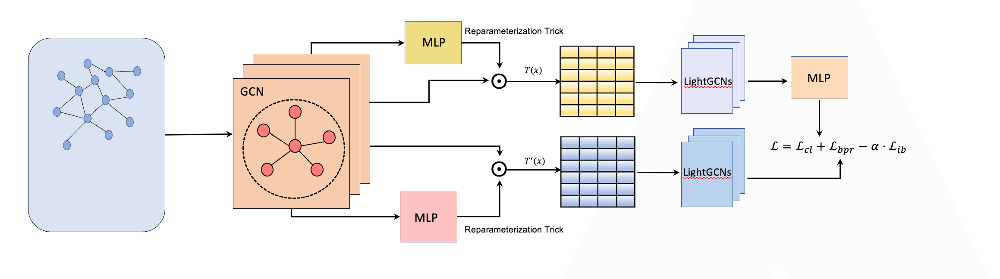

# gicbcl
Graph contrastive learning vector recall algorithm with information bottleneck theory

该算法主要是输出embedding vector供下游任务进行向量召回

GIBCL算法包含两个部分：exection.py主要执行图对比学习，输出图节点的embedding vectors; 但是在实践中发现，将exection.py输出的graph embedding然后再用双塔模型与基础画像特征进行融合后，可以显著提升效果，因此doubletowersrecall.py主要是采用一个双塔DNN模型来对特征进行融合。

关于图对比学习中可学习增广idea参考于Wei, Chunyu, et al. "Contrastive Graph Structure Learning via Information Bottleneck for Recommendation." Advances in Neural Information Processing Systems 35 (2022): 20407-20420.

